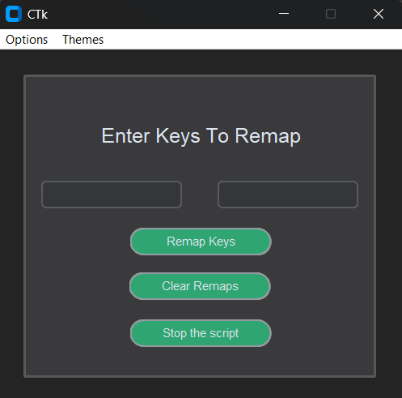

# Keyboard Keys Remapper

A program that lets you remap your keyboard keys using a simple GUI. The program requires a file path to store the remaps, which can be set from the **Options** drop-down menu.

Another option lets you change the GUI theme and adjust the window opacity.



## Requirements

* Python 3.10+
* keyboard
* customtkinter

```bash
pip install keyboard customtkinter
```

## Running the program

```bash
git clone <repo-url>
cd Keyboard-keys-remaps-
python gui.py
```

## Function keys input for the program


| Key        | Input                   |
|----------- |-------------------------|
| esc        | esc                     |
| Space      | space                   |
| left ctrl  | ctrl                    |
| right ctrl | right ctrl              |
| left shift | shift                   |
| right shift| right shift             |
| tab        | tab                     |
| enter      | enter                   |
| windows key| left windows            |
| caps lock  | caps lock               |
